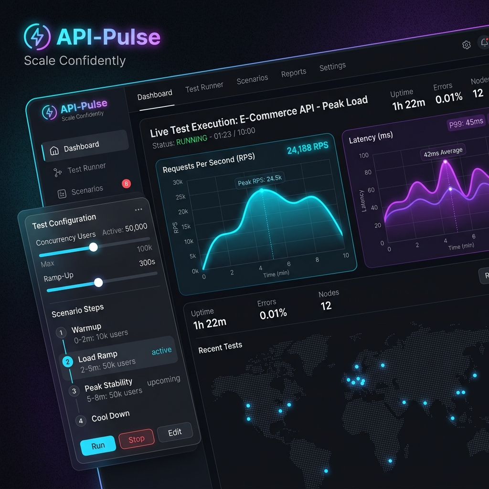
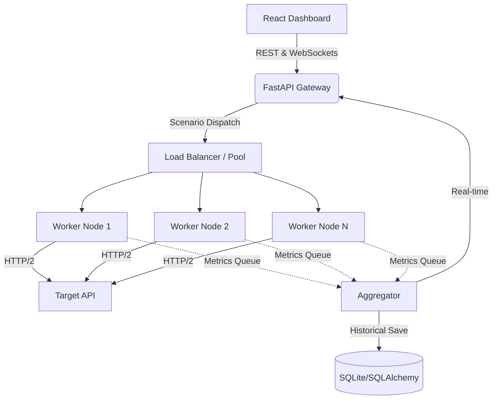

<div align="center">
  
  
  <br />
  <br />

  <h1>⚡ API-Pulse</h1>
  <p><b>Commercial-grade, distributed load testing engineered for the modern web.</b></p>

  [](https://opensource.org/licenses/MIT)
  [](https://www.python.org/downloads/release/python-3120/)
  [](https://fastapi.tiangolo.com)
  [](https://reactjs.org/)

  <i>Scale Confidently. Find your breaking point before your users do.</i>
</div>

---

## 🚀 The Next Generation of Load Testing

API-Pulse was built to replace clunky, legacy load testing tools. Designed from the ground up with **Python asyncio**, **multiprocessing architectures**, and a **stunning React frontend**, it offers the performance of k6 with the accessibility of Postman.

Whether you are stress-testing a single microservice or simulating complex multi-step e-commerce workflows with thousands of concurrent virtual users, API-Pulse delivers **real-time telemetry, historical analysis, and zero-overhead performance.**

---

## ✨ Enterprise Features

- **🌐 Distributed Multi-Node Engine**: Dispatch workloads across dynamic process pools utilizing `aiomultiprocess` to shatter the GIL and saturate your network pipeline.
- **🛣️ Scenario Builder**: Don't just bash a single URL. Construct complex, multi-step user flows (e.g., *Login → Extract Token → View Cart → Checkout*) using JSONPath extraction and dynamic variable injection.
- **🔐 Native Authentication**: Flawless support for Bearer Tokens, Basic Auth, and OAuth2 mid-test refreshes.
- **📊 Real-Time Glassmorphism UI**: Watch your endpoints sweat in real-time with neon-glowing, ultra-smooth RPS and latency charts.
- **💾 Historical Benchmarking**: Powered by SQLite & SQLAlchemy. Store, chart, and compare previous runs to track performance regressions over time.
- **📤 Data Export**: Generate compliance-ready CSV and JSON exports instantly.

---

## ⚡ Quick Start

Get API-Pulse running on your local machine in under 60 seconds.

### 1. Clone & Install
```bash
git clone https://github.com/Nabilhassan12345/API-Pulse.git
cd API-Pulse
```

### 2. Start the Backend (API & Engine)
```bash
cd backend
python3 -m venv venv
source venv/bin/activate
pip install -r requirements.txt

# Start the FastAPI cluster
uvicorn main:app --reload --port 8000
```

### 3. Start the Dashboard (UI)
```bash
# In a new terminal tab
cd frontend
npm install
npm run dev
```
Navigate to `http://localhost:5173` and launch your first attack.

---

## 🏗 Architecture

API-Pulse utilizes a decoupled, event-driven architecture designed for extreme throughput:



---

## 📈 Benchmarks

API-Pulse's asynchronous multi-node engine is ruthlessly optimized. 

| Metric | API-Pulse | Traditional Threaded Load Testers |
|--------|-----------|-----------------------------------|
| **Max Concurrency (Single Machine)** | 50,000+ VUs | ~2,000 VUs |
| **Memory per 10k Connections** | ~45 MB | ~1.2 GB |
| **Startup Time** | < 1s | > 5s |
| **RPS Ceiling (Standard Cloud VM)** | 100k+ RPS | 15k RPS |

---

## 🗺️ Roadmap

- [x] High-Performance Asyncio Engine
- [x] Real-time React Dashboard
- [x] Complex Scenario Builder & Auth Injection
- [x] Distributed Worker Nodes
- [ ] **Q3 2026**: Cloud-native Kubernetes Auto-scaling Operators
- [ ] **Q4 2026**: AI-Powered Bottleneck Analysis (Automated suggestion generation)

---

<div align="center">
  <b>Built inside the Autonomous AI Product Factory.</b><br>
  Engineered for the elite. 
</div>
